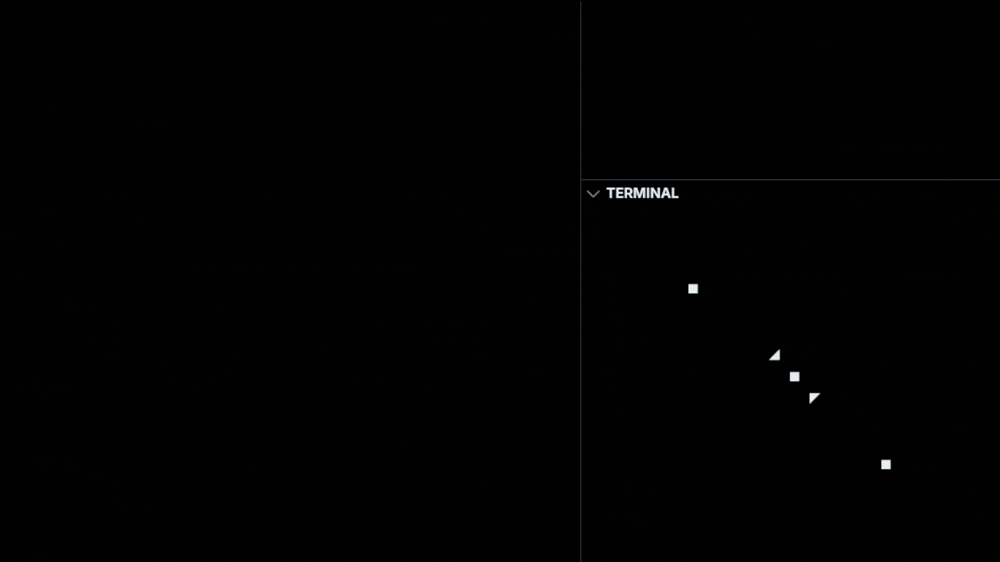

# TerminalPositions

## TerminalPosition

Essa classe simples é usada para 'guardar' de forma simples as posições { top, left }.

## TerminalResponsivePosition

Essa classe é usada para definir posições relativas a largura e altura do terminal, como 
parametros entre 0 e 1. Exemplo: { top: 0.5, left: 0.5 } representa o centro do terminal.

## TerminalSumPositions 

Essa classe recebe uma lista de posições e retorna a soma delas, para `top` e `left`; esta
class é usada internamente para compor posições relativas.

## Exemplo de uso

```typescript
import {  
  TerminalSumPositions as Rel, 
  TerminalResponsivePosition as Res } from "./src/TerminalPositions"
import { print } from "./src/AnsiEscs.print"

// Posições responsivas 
const res1 = new Res({ top: .25, left: .25 })
const res2 = new Res({ top: .5 , left: .5  })
const res3 = new Res({ top: .75, left: .75 })

// Posições relativas
const rel1 = new Rel(res2, { left: -2, top: -1 })
const rel2 = new Rel(res2, { left: 2, top: 1 })

const draw = () => {
  console.clear()
  // Posições responsivas
  print(res1, '◼')    
  print(res2, '◼')
  print(res3, '◼')

  // Posições relativas ao res2 (centro)
  print(rel1, '◢')
  print(rel2, '◤')
}

process.stdout.on('resize', draw)
draw()
```

## Resultado:

